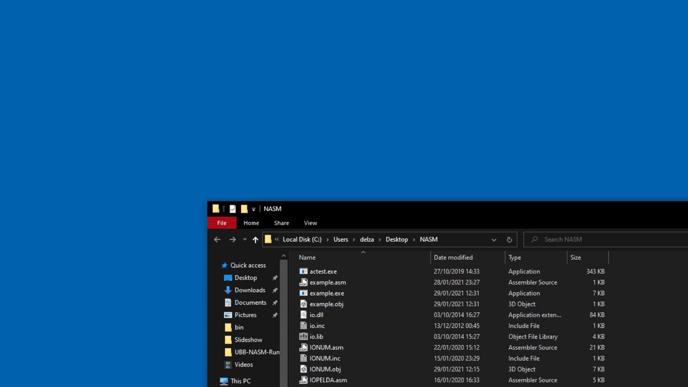

# Manually compiling UBB NASM projects

Everything should be in the **same directory** for the
sake of simplicity.

:bulb: You should create a **script** which you can then 
run any time, without having to scroll through command
history or retype anything. If something needs to be changed
you can just edit the script itself.



## Compile single file project

`example.asm` ↴

```assembly
%include 'io.inc'

global main

section .text

main:
    mov     eax, str
    call    io_writestr

    ret

section .data
    str:    db  "Hello, world!", 0
```
<br/>

`compile.bat` ↴

```batch
@echo off

.\nasm.exe -f win32 example.asm

if %errorlevel% equ 0 (
    .\nlink.exe example.obj -lio -o example.exe
    
    if %errorlevel% equ 0 (
        .\example.exe
    )
)

echo.
echo.
pause
```

- `@echo off` keeps the console clean
  

- `.\nasm.exe -f win32 example.asm` compiles `example.asm` into `example.obj`  
  `-f win32` is for format Win32 (i386)  
  More details [here](https://nasm.us/doc/nasmdoc2.html)


- `%errorlevel%` is the last exit code, so if `nasm.exe` 
  failed with errors, the script stops, this way it doesn't
  compile with the older object file, or if only the linker
  fails then it won't run the older executable


- `.\nlink.exe example.obj -lio -o example.exe` creates the
  executable from `example.obj` and `io.lib`  
  `-lio` is required for `%include 'io.inc'` to work  
  `-lmio` for `'mio.inc'`  
  `-o example.exe` is the output path/name, if you omit this,
  then it defaults to `a.exe`


- Finally, if everything is **OK** so far, we run the executable
  `.\example.exe`
  

- `echo.` just prints a new line


- `pause` is for keeping the console from closing, but
  it might be annoying if you run the script from
  a terminal directly, in that case it should be left out


## Compile multiple file project

Say you want to compile `STRPELDA.asm`, like in the demo image
you might've seen  

It has the following includes ↴

```assembly
%include 'IOSTR.inc'
%include 'STRINGS.inc'
%include 'IONUM.inc'
```

> :information_source: These all have their `*.asm` counterparts that need to be
> compiled and those `*.asm` files have their own includes  
> Some are shared, like `IOSTR.inc` both in `STRPELDA.asm`
> and `IONUM.asm`, or `mio.inc` in 
> everything except `STRPELDA.asm`

You probably get the idea from this code snippet ↴

```batch
@echo off

.\nasm.exe -f win32 IOSTR.asm
.\nasm.exe -f win32 STRINGS.asm
.\nasm.exe -f win32 IONUM.asm
.\nasm.exe -f win32 STRPELDA.asm

if %errorlevel% equ 0 (
    .\nlink.exe STRPELDA.obj IOSTR.obj STRINGS.obj IONUM.obj -lmio -o STRPELDA.exe
    
    if %errorlevel% equ 0 (
        .\STRPELDA.exe
    )
)

echo.
echo.
pause
```