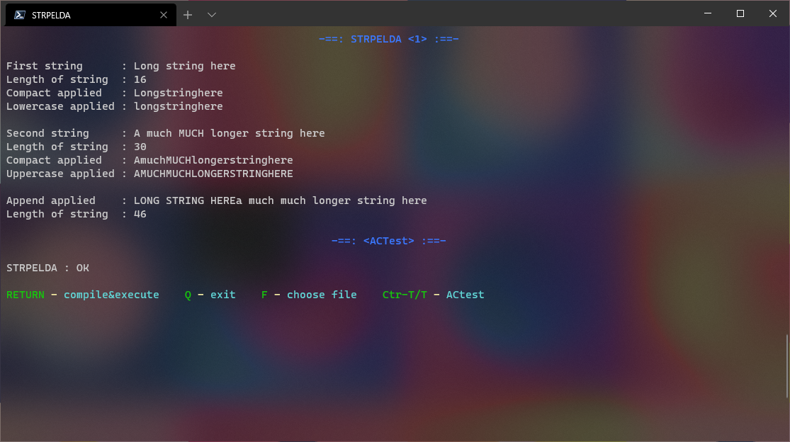

# UBB NASM Runner

This program compiles and runs and tests assembly project files **at the press of a single button**,
instead of having to struggle with all those pesky terminal commands.

> :warning: You'll most probably be tasked to compile / link / run a project **_manually_** for **exams**,
> [here's some help with that](COMPILEGUIDE.md)



### Convenient

- Keeps your folder **clean**, uncluttered
- Run/test projects _fast_ without ever having to retype stuff
- Remembers the _"lab string"_ for `actest.exe` for the
  currently selected assembly project
- For a _cleaner/transparent_ look separates instances of tests/runs
  with colored text

### Controls

- <kbd>Enter</kbd> compiles the currently selected 
  project file and if successful, runs it
- <kbd>F</kbd> selects which project file 
  you wish to run/test
- <kbd>T</kbd> runs `actest.exe`, if a _"lab string"_ hasn't 
  been set yet, it will ask for it first
- <kbd>Ctrl</kbd> + <kbd>T</kbd> always asks for _"lab string"_, 
  meant for correcting a bad  _"lab string"_
- <kbd>Q</kbd> exits the program

> **NOTE** if a currently running program is
> stuck, <kbd>Ctrl</kbd> + <kbd>C</kbd> will kill it without
> killing `UBB-NASM-Runner`  
>> :bulb:Unfortunately if the program is stuck asking for input
>> then this won't help, you should do one of the following 
>> (say you run `STRPELDA`, like in the image above) :  
>> - close the `UBB-NASM-Runner` window (loss of history), or 
>> - <kbd>Ctrl</kbd> + <kbd>Shift</kbd> + <kbd>Esc</kbd>,
>> find `STRPELDA.exe` and terminate it, or
>> - open `cmd` and type
>> ```batch
>> taskkill /F /im STRPELDA.exe
>> ```

## Download

- [:arrow_double_down:UBB-NASM-Runner.exe](https://github.com/FLevent29/UBB-NASM-Runner/releases/download/1.0/UBB-NASM-Runner.exe)
\- needs [.NET Core Runtime 5](https://dotnet.microsoft.com/download/dotnet/current/runtime)  
  &nbsp;&nbsp;&nbsp;&nbsp;&nbsp;&nbsp;&nbsp;&nbsp;&nbsp;&nbsp;&nbsp;&nbsp;&nbsp;&nbsp;- or -
- [:arrow_double_down:UBB-NASM-Runner-standalone.exe](https://github.com/FLevent29/UBB-NASM-Runner/releases/download/1.0/UBB-NASM-Runner-standalone.exe)
\- takes up more space

## Install

Place `UBB-NASM-Runner` in the folder where you have your _assembly projects_ 
and all the _[binaries](https://www.cs.ubbcluj.ro/~afra/ac/aclab.zip)_ 
and the _[tester](https://www.cs.ubbcluj.ro/~scsanad/actest/actest.zip)_ 
provided by the university.

Execute it with a terminal, like [Windows Terminal](https://github.com/microsoft/terminal#installing-and-running-windows-terminal) 
or through file explorer.

> :warning: Once you start `UBB-NASM-Runner` it will ask you
> if you want your project files moved into `\projects` folder or ` \ `&nbsp;
> (you probably (will) keep them in ` \ `&nbsp;either way)   
> These are your two options, because of how `nasm.exe` handles
> paths, it cannot escape spaces for include files, so
> if you had your projects and it's include files in
> `\my project folder` then `nasm.exe` would start complaining
> (NASM version 2.11.08)
>> :information_source: You can change the selected 
>> directory for your projects by deleting `\bin\hushprojects` 
>> and restarting the application
